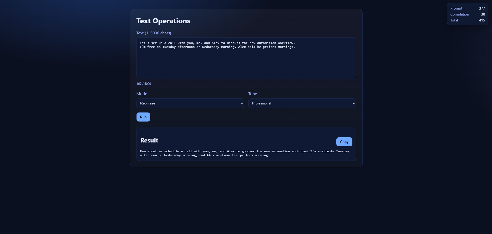
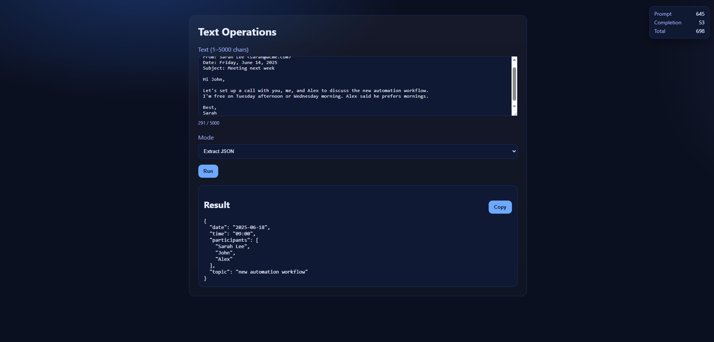

# mindtech_openai_app

Minimal web application that accepts user text and performs one of four OpenAI-powered operations: Summarize, Rephrase (tone-controlled), Extract JSON, Classify sentiment. The app exposes a single backend endpoint and a simple frontend to exercise it.

## Quick start

1) Create `.env` in the repo root (see `.env.example`).

2) Install backend deps and run the server:

```
cd backend
pip install -r ../requirements.txt
uvicorn app:app --reload
```

3) Open the app UI at `http://localhost:8000/`.

## Environment variables

See `.env.example`:

```
OPENAI_API_KEY=sk-...
SUMMARIZE_PROMPT_ID=pmpt_...
REPHRASE_PROMPT_ID=pmpt_...
EXTRACT_JSON_PROMPT_ID=pmpt_...
CLASSIFY_SENTIMENT_PROMPT_ID=pmpt_...
```

## API

- Method/Path: `POST /api/run`
- Request body:

```
{
  "mode": "summarize" | "rephrase" | "extract_json" | "classify",
  "text": "1..5000 chars",
  "tone": "casual" | "professional" | "friendly" // required when mode=rephrase
}
```

- Response body:

```
{
  "result": "string or JSON object",
  "usage": { "prompt_tokens": number, "completion_tokens": number, "total_tokens": number }
}
```

## Frontend

Static files are served from `frontend/` by the FastAPI app. The UI provides:

- Text input (1–5000 chars)
- Mode selector (summarize, rephrase, extract_json, classify)
- Tone selector appears when Mode = rephrase (casual | professional | friendly)
- Result panel with copy-to-clipboard
- Pretty-printed JSON when Mode = extract_json
- Token usage (prompt, completion, total)

## Notes

- The OpenAI API key stays on the server; the browser only calls your backend.
- Errors are returned as human-readable messages; no stack traces leak to the UI.

## Tests

- summarize with valid input returns 200 and non-empty result.
- rephrase without tone returns 400.
- classify returns one of the three allowed labels.
- extract_json returns valid JSON with all required keys.
- Rate limit path returns 429 after threshold (can be a lowered threshold in test).
- Pytest library
- all tests are succesffuly passed ;)

## Screenshots

### UI


### JSON
