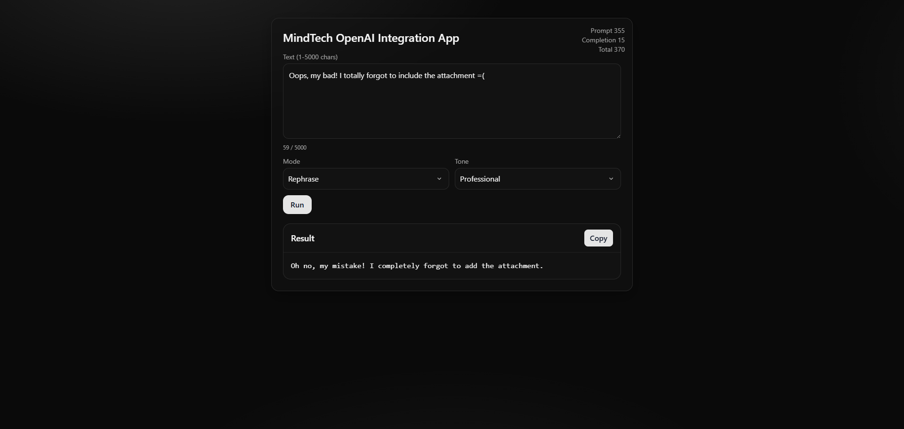

# MindTech OpenAI Integration App

A minimal full‑stack demo that processes text via an OpenAI‑powered backend with four modes:

- summarize
- rephrase (tone: casual, professional, friendly)
- extract_json (returns structured JSON)
- classify sentiment

Frontend is a React + Vite app (Tailwind UI). Backend is FastAPI.

## Prerequisites

- Python 3.10+
- Node.js 18+

## 1) Configure environment

Create a `.env` in the repo root (see `env.example`):

```env
OPENAI_API_KEY=sk-...
OPENAI_MODEL=gpt-4o-mini
SUMMARIZE_PROMPT_ID=pmpt_...
REPHRASE_PROMPT_ID=pmpt_...
EXTRACT_JSON_PROMPT_ID=pmpt_...
CLASSIFY_SENTIMENT_PROMPT_ID=pmpt_...

# Optional rate limiting (defaults shown)
RATE_LIMIT_REQUESTS=20
RATE_LIMIT_WINDOW_SEC=60
```

## 2) Run the backend

```bash
cd backend
pip install -r ../requirements.txt
uvicorn app:app --reload --port 8000
```

API base: `http://localhost:8000`

## 3) Run the frontend

```bash
cd frontend
npm install
npm run dev
```

Open: `http://localhost:5173`

The frontend calls the backend at `/api/run` (same origin in production; in dev, ensure your browser can reach `http://localhost:8000`). If needed, configure a Vite proxy in `frontend/vite.config.js`.

## API

- __POST__ `/api/run`

Request:

```json
{
  "mode": "summarize" | "rephrase" | "extract_json" | "classify",
  "text": "1..5000 chars",
  "tone": "casual" | "professional" | "friendly"
}
```

Notes:
- `tone` is required only when `mode` = `rephrase`.

Response:

```json
{
  "result": "string or JSON",
  "usage": { "prompt_tokens": 0, "completion_tokens": 0, "total_tokens": 0 }
}
```

## Prompts

We use four pre-authored prompts (see `PROMPTS.md`) identified by environment variables:

- summarize → `SUMMARIZE_PROMPT_ID`
- rephrase → `REPHRASE_PROMPT_ID`
- extract_json → `EXTRACT_JSON_PROMPT_ID`
- classify sentiment → `CLASSIFY_SENTIMENT_PROMPT_ID`

Each prompt is designed for its task:
- __Summarize__: distills input into a short paragraph.
- __Rephrase__: rewrites to a requested tone (friendly/professional/casual) without changing meaning.
- __Extract JSON__: extracts structured fields; client pretty‑prints JSON.
- __Classify__: returns a one‑word sentiment label.

See `PROMPTS.md` for the exact wording and example behaviors.

## Frontend features


- __React + Vite__: React 19 + Vite dev server with SWC plugin (`@vitejs/plugin-react-swc`).
- __API integration__: Calls `POST /api/run` with `{ mode, text, tone? }`; surfaces backend error `detail`.
- __Submit guarding__: Disables submit when invalid or busy; shows "Running…" while awaiting response.
- __Result rendering__:
  - For `extract_json`, attempts to parse and pretty‑print JSON; falls back to plain text on parse failure.
  - Client‑side JSON syntax highlighting via `syntaxHighlight()` in `frontend/src/App.jsx`.
- __Clipboard__: One‑click copy of the result via `navigator.clipboard`.
- __Floating usage widget__: Token usage (prompt/completion/total) shown when a result exists.
- __Styling__: Tailwind utility classes with custom theme tokens (e.g., `bg-card`, `border-border`, `accent`, `text-muted`).
- __Custom selects__: Chevron added via CSS background in `frontend/src/index.css` (`.select-chev`).
- __A11y basics__: Associated `<label>` tags, `required`, `minLength`/`maxLength`, and disabled states.

## Backend design

- __FastAPI service__: `backend/app.py` with a single typed endpoint `POST /api/run` returning `RunResponse`.
- __Validation__: Pydantic `RunRequest` enforces 1–5000 chars; `tone` required when `mode = rephrase`.
- __OpenAI integration__: Uses `OPENAI_API_KEY` and `OPENAI_MODEL` (Responses API). Prompt IDs per mode via env vars.
- __Mode tuning__: Temperature defaults to 0.2; `extract_json` forced to 0.0 for determinism.
- __JSON handling__: When `mode = extract_json`, tries to parse JSON; falls back to raw string if parsing fails.
- __Usage metering__: Normalizes token usage from SDK fields into `{prompt, completion, total}`.
- __Error handling__: Maps upstream errors to proper HTTP codes/messages; avoids leaking stack traces.
- __Rate limiting__: In‑memory sliding window, configurable via `RATE_LIMIT_REQUESTS`/`RATE_LIMIT_WINDOW_SEC`.
- __Config__.env__: Loaded via `python-dotenv`; all secrets stay server‑side.

## API design

- __Endpoint__: `POST /api/run`
- __Contract__: Request/response shapes shown above. The `mode` drives behavior; `tone` is required only for `rephrase`.
- __Determinism__: `extract_json` uses `temperature=0.0` to make outputs stable for parsing.
- __Rate limit__: Returns 429 with `Retry-After` header when the per‑IP window is exceeded.
- __CORS__: Development CORS is permissive to simplify local testing.

## Error handling

- __Client errors__ (400): Validation issues like missing `tone` for `rephrase`.
- __Rate limit__ (429): Too many requests in the window; `Retry-After` indicates when to retry.
- __Upstream errors__ (5xx): OpenAI failures are surfaced with safe, human‑readable messages.
- __Misconfiguration__ (500): Missing `OPENAI_API_KEY` or prompt IDs return clear setup errors.

## Tests

Run backend tests from repo root:

```bash
pytest -q
```

Included checks (see `tests/test_api.py`):
- summarize returns 200 + non‑empty
- rephrase missing tone → 400
- classify returns allowed label
- extract_json returns valid JSON
- rate‑limit returns 429 after threshold

---
__sample prompts are in `sample.txt`__

## Screenshots

__UI__:


__JSON__:


__Rephrase__:


